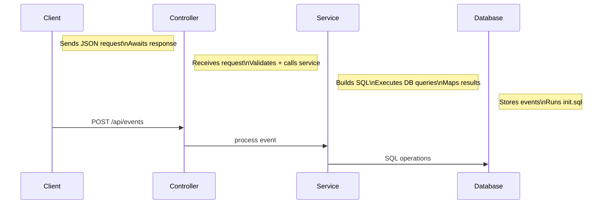

# calendar-microservice
Microservice for handling calendar events in the Small Pool project.

## How to Request Data From This Microservice

Requests are made to the microservice running at `http://localhost:4350/api/events` using HTTP GET calls.

## How to Receive Data From This Microservice

Responses are given in JSON format. The functions called by the user wait for the microservice to send back a response. This response can then be
outputted to the console to see if the function operated successfully or if an error was caught.

# Example Call

- **Register New Event**
  - Example:
    ```js
    let response = await fetch("http://localhost:4350/api/events", {
    method: "POST",
    headers: {
      "Content-Type": "application/json",
      Authorization: key,
    },
    body: JSON.stringify({
      title: "Test Event",
      startTime: "Sun, 16 Nov 2025 04:32:33 GMT",
      endTime: "Sun, 16 Nov 2025 04:32:33 GMT",
      description: "Test Description",
    }),
    });
    console.log(`STATUS: ${response.status}\n`);
    ```
  - Example Response:
    ```json
    {
        "STATUS: 200"
    }
    ```

# Example Call

- **Get All Events Within Period**
  - Example:
    ```js
     response = await (
    await fetch("http://localhost:4350/api/events?startTime=11/15/2025&endTime=11/17/2025", {
      headers: {
        "Content-Type": "application/json",
        Authorization: key,
        },
        })
    ).json();

    console.log(`RESPONSE: ${JSON.stringify(response)}\n`);
        }),
    });
    ```
  - Example Response:
    ```json
    {
        [{"eventId":"event-aabb1d83-cc21-48c9-a985-7be999e8455b",
        "title":"Test Event",
        "startTime":"2025-11-16 04:32:33",
        "endTime":"2025-11-16 04:32:33",
        "description":"Test Description"}]
    }
    ```

## UML Diagram



## Running the service

To run the service, you first need to install docker.
Go to this link and download a version that works with your device:
https://docs.docker.com/get-started/get-docker/

Once you have docker installed, use this to build the microservice
```bash
docker compose up
````
When going through the building process you might be asked to add dependencies you don't have.
Visual Studios Code will do its best to walk you through this process, don't be afraid to search online for the dependencies if you are still having trouble with installation.


Once your microservice has been built with Docker, you can run your test script with this following command:
```bash
node test/index.js
```

This will launch the microservice on port 4350.


## Contributors
Alexander Kronsup, Ryan Floyd, Rowan Whitmore, Anthony Pham
