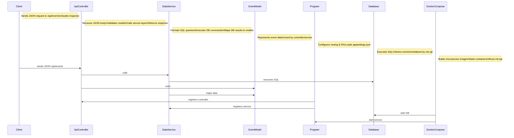

# calendar-microservice
Microservice for handling calendar events in the Small Pool project.

## UML Diagram

```mermaid
sequenceDiagram
    participant Client
    participant ApiController
    participant DataService
    participant EventModel
    participant Program
    participant Database
    participant DockerCompose

    Note right of Client: Sends JSON request to /api/events\nAwaits response
    Note right of ApiController: Receives JSON body\nValidates model\nCalls service layer\nReturns response
    Note right of DataService: Formats SQL queries\nExecutes DB commands\nMaps DB results to models
    Note right of EventModel: Represents event data\nUsed by controller/service
    Note right of Program: Configures routing & DI\nLoads appsettings.json
    Note right of Database: Executes SQL\nStores events\nInitialized by init.sql
    Note right of DockerCompose: Builds microservice image\nStarts containers\nRuns init.sql

    Client ->> ApiController: sends JSON /api/events
    ApiController ->> DataService: calls
    DataService ->> Database: executes SQL
    ApiController ->> EventModel: uses
    DataService ->> EventModel: maps data

    Program ->> ApiController: registers controller
    Program ->> DataService: registers service

    DockerCompose ->> Database: start DB
    DockerCompose ->> Program: start service
```

## Contributors
Alexander Kronsup, Ryan Floyd, Rowan Whitmore, Anthony Pham
